# 시스템 아키텍처 다이어그램

본 문서는 Agent Framework와 Generative UI 통합 시스템의 상세한 아키텍처 다이어그램을 포함합니다.

---

## 1. 전체 시스템 아키텍처

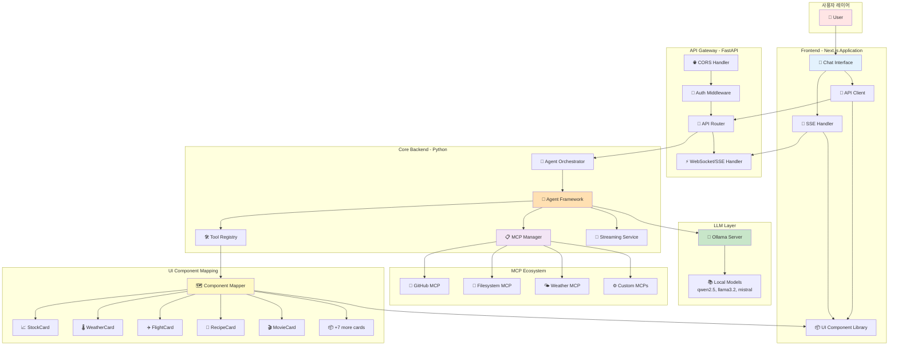

---

## 2. 데이터 흐름 아키텍처

```mermaid
flowchart LR
    subgraph "Input"
        A[User Message]
    end

    subgraph "Processing Pipeline"
        B[FastAPI Router]
        C[Agent Orchestrator]
        D[Intent Analysis]
        E[LLM Processing]
        F[Tool Selection]
        G[MCP Execution]
        H[Response Generation]
        I[Component Selection]
    end

    subgraph "Output"
        J[Streaming Response]
        K[UI Component]
        L[Rendered UI]
    end

    A --> B
    B --> C
    C --> D
    D --> E
    E --> F
    F --> G
    G --> H
    H --> I
    I --> J
    J --> K
    K --> L

    style A fill:#BBDEFB
    style E fill:#C8E6C9
    style G fill:#F8BBD0
    style I fill:#FFF9C4
    style L fill:#B2DFDB
```

---

## 3. 채팅 메시지 처리 시퀀스

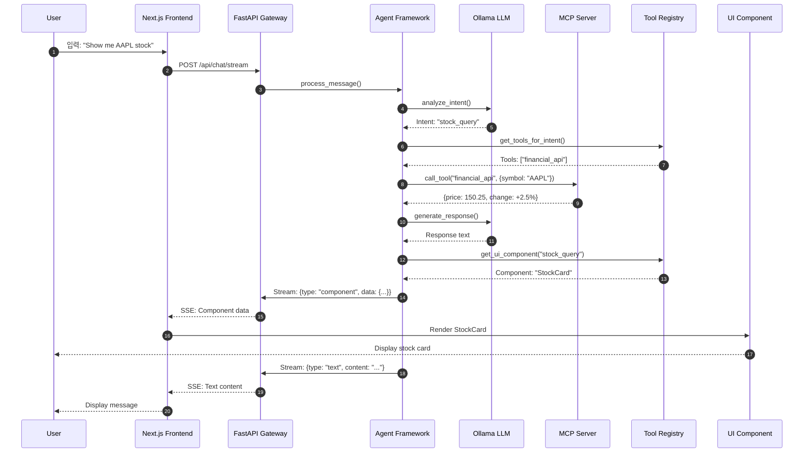

---

## 4. MCP 서버 생명주기

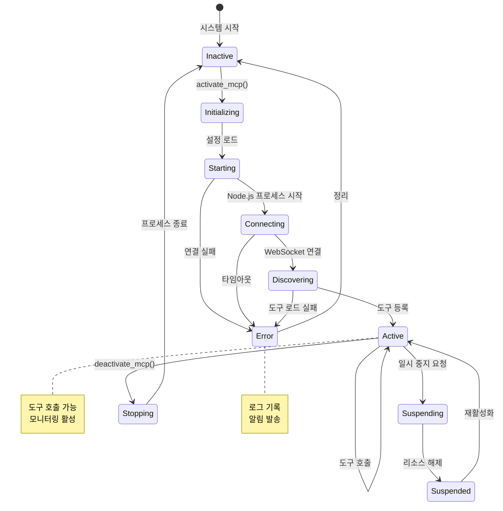

---

## 5. 컴포넌트 계층 구조

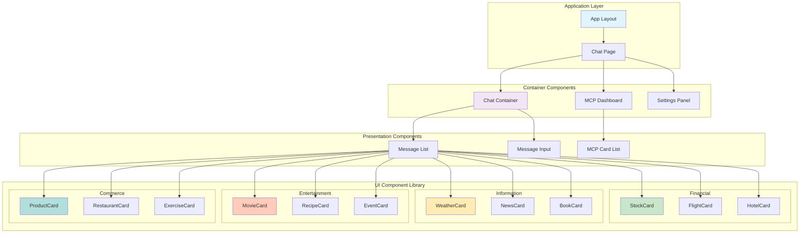

---

## 6. Backend 모듈 구조

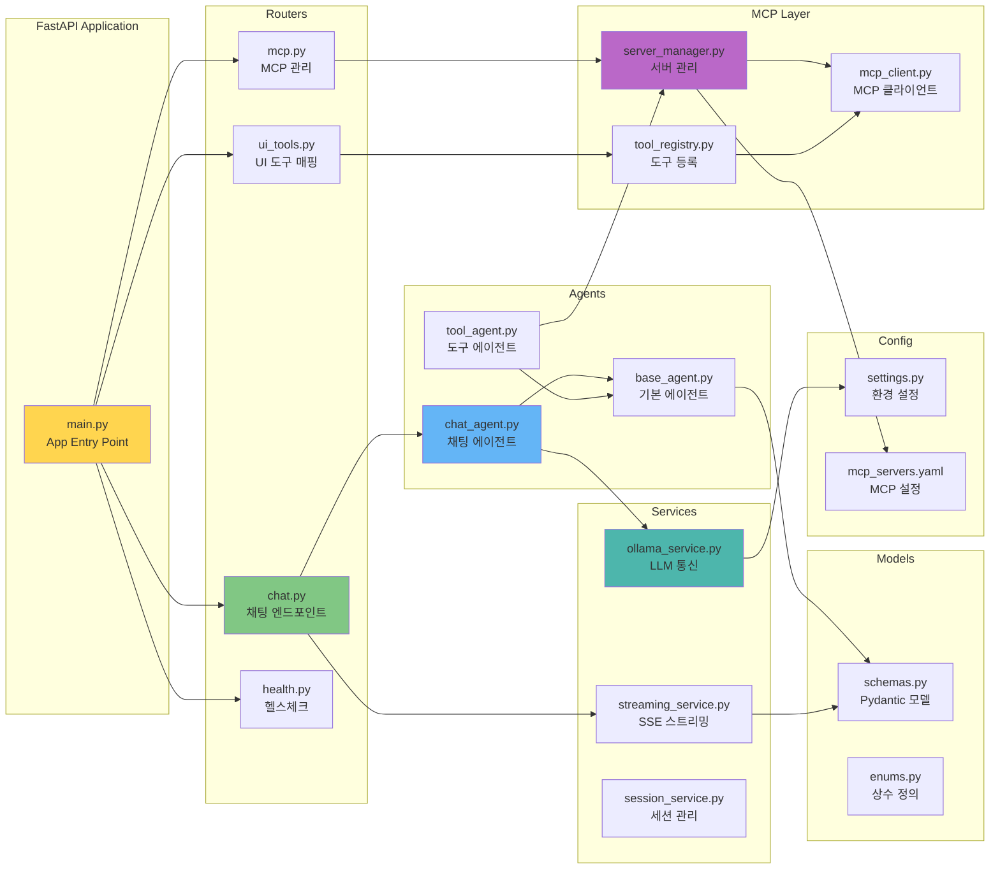

---

## 7. MCP 도구 → UI 컴포넌트 매핑

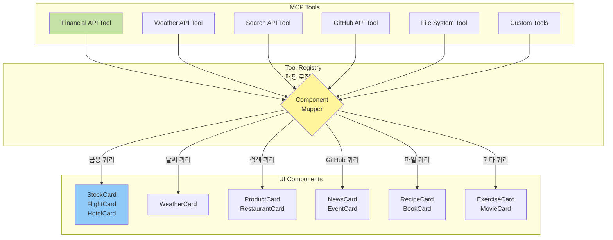

---

## 8. 스트리밍 프로토콜 구조

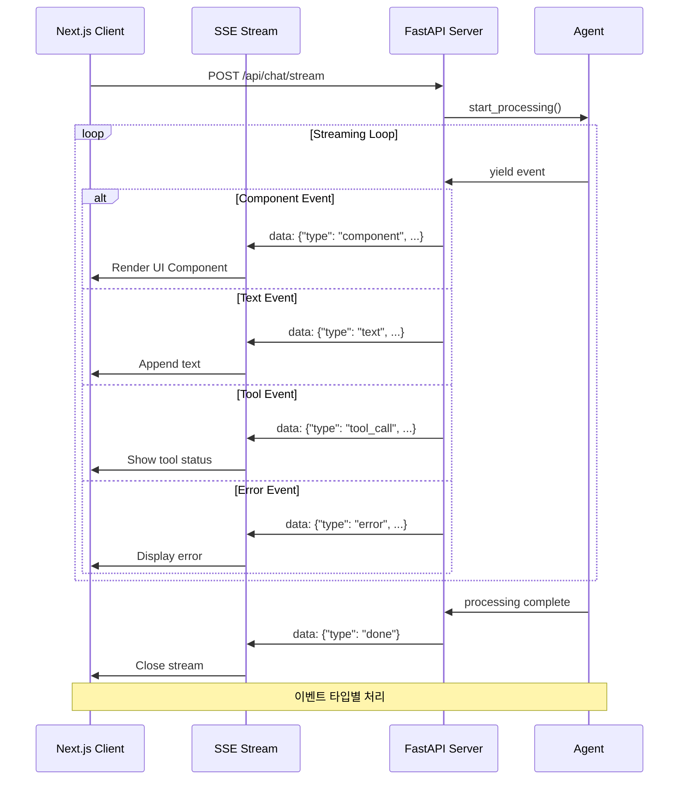

---

## 9. 보안 레이어 구조

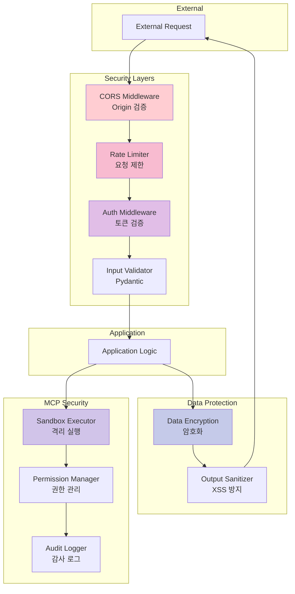

---

## 10. 배포 아키텍처

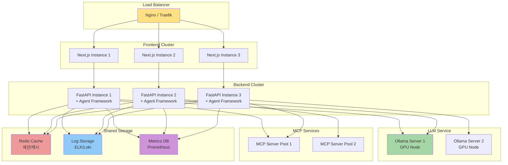

---

## 11. 개발 환경 구조

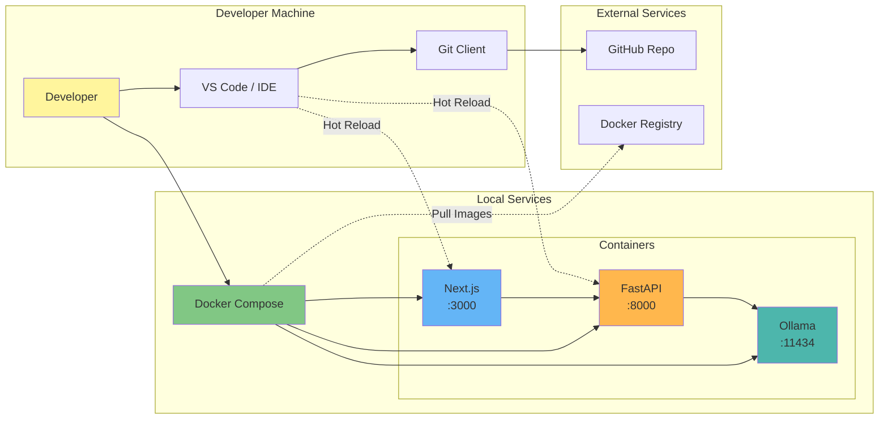

---

## 12. 성능 모니터링 플로우

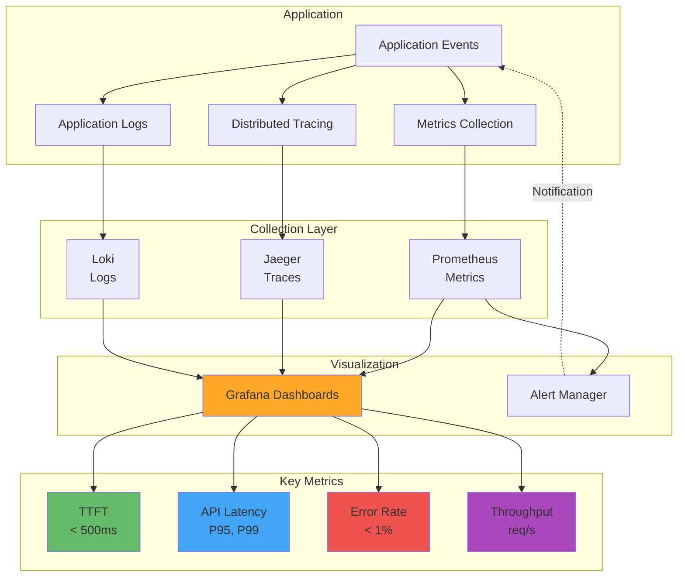

---

## 다이어그램 설명

### 주요 아키텍처 패턴

1. **레이어드 아키텍처**: Frontend, API Gateway, Backend Core, LLM/MCP 계층 분리
2. **마이크로서비스 요소**: MCP 서버를 독립적인 서비스로 관리
3. **이벤트 드리븐**: SSE 기반 비동기 스트리밍
4. **플러그인 아키텍처**: MCP 도구를 동적으로 추가/제거
5. **컴포넌트 기반 UI**: 재사용 가능한 UI 컴포넌트 라이브러리

### 핵심 설계 원칙

- **느슨한 결합**: 각 레이어는 독립적으로 교체 가능
- **높은 응집도**: 관련 기능을 모듈로 그룹화
- **확장성**: 수평 확장 가능한 구조
- **관찰 가능성**: 로깅, 메트릭, 트레이싱 통합
- **보안 우선**: 다층 보안 레이어

---

**다이어그램 버전**: 1.0.0
**최종 업데이트**: 2025-11-21
