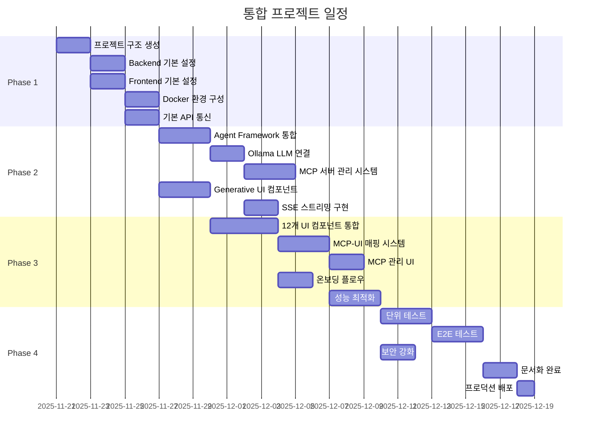

# 구현 작업 체크리스트

본 문서는 Agent Framework와 Generative UI 통합 프로젝트의 상세한 구현 작업 목록을 제공합니다.

---

## 📊 프로젝트 진행 현황



---

## Phase 1: 기반 구축 (Week 1-2)

### 1.1 프로젝트 구조 생성

#### 작업 내용
- [ ] 루트 디렉토리 구조 생성
- [ ] Backend 디렉토리 구조 생성
- [ ] Frontend 디렉토리 구조 생성
- [ ] 공유 리소스 디렉토리 생성
- [ ] 문서 디렉토리 생성
- [ ] 스크립트 디렉토리 생성

#### 세부 작업

```bash
# 디렉토리 구조 생성 스크립트
mkdir -p backend/{agents,mcp,routers,services,models,config}
mkdir -p frontend/{app,components/{ui,chat,mcp},lib,public}
mkdir -p shared/{schemas,types}
mkdir -p config
mkdir -p docs/diagrams
mkdir -p scripts
mkdir -p docker
```

#### 체크리스트
- [ ] 모든 디렉토리가 올바르게 생성되었는지 확인
- [ ] `.gitignore` 파일 생성 및 설정
- [ ] `README.md` 파일 생성
- [ ] `CHANGELOG.md` 파일 초기화

#### 완료 조건
- 모든 필수 디렉토리가 존재
- Git 저장소가 초기화됨
- 기본 문서 파일이 생성됨

---

### 1.2 Backend 기본 설정

#### 작업 내용
- [ ] Python 가상 환경 설정
- [ ] FastAPI 프로젝트 초기화
- [ ] 기본 의존성 설치
- [ ] 환경 변수 설정
- [ ] 로깅 설정

#### 세부 작업

**1. 가상 환경 및 의존성**
```bash
cd backend
python -m venv venv
source venv/bin/activate  # Windows: venv\Scripts\activate
pip install --upgrade pip
```

**2. requirements.txt 생성**
```txt
# Core
fastapi==0.104.1
uvicorn[standard]==0.24.0
pydantic==2.5.0
pydantic-settings==2.1.0

# HTTP Client
httpx==0.25.0
aiohttp==3.9.0

# LLM
ollama==0.1.5

# Utils
python-dotenv==1.0.0
pyyaml==6.0.1
python-multipart==0.0.6
aiofiles==23.2.1

# WebSocket/SSE
websockets==12.0
sse-starlette==1.8.2

# Testing
pytest==7.4.3
pytest-asyncio==0.21.1
pytest-cov==4.1.0
httpx-sse==0.4.0

# Development
black==23.11.0
flake8==6.1.0
mypy==1.7.0
```

**3. main.py 생성**
```python
# backend/main.py
from fastapi import FastAPI
from fastapi.middleware.cors import CORSMiddleware
from contextlib import asynccontextmanager
import logging

from config.settings import settings
from routers import chat, mcp, ui_tools, health

# 로깅 설정
logging.basicConfig(
    level=getattr(logging, settings.LOG_LEVEL.upper()),
    format='%(asctime)s - %(name)s - %(levelname)s - %(message)s'
)
logger = logging.getLogger(__name__)

@asynccontextmanager
async def lifespan(app: FastAPI):
    """애플리케이션 생명주기 관리"""
    logger.info("Starting application...")
    # Startup logic
    yield
    # Shutdown logic
    logger.info("Shutting down application...")

app = FastAPI(
    title="Agent Framework + Generative UI",
    description="통합 AI 에이전트 시스템",
    version="1.0.0",
    lifespan=lifespan
)

# CORS 설정
app.add_middleware(
    CORSMiddleware,
    allow_origins=settings.CORS_ORIGINS.split(","),
    allow_credentials=True,
    allow_methods=["*"],
    allow_headers=["*"],
)

# 라우터 등록
app.include_router(health.router, prefix="/api", tags=["health"])
app.include_router(chat.router, prefix="/api/chat", tags=["chat"])
app.include_router(mcp.router, prefix="/api/mcp", tags=["mcp"])
app.include_router(ui_tools.router, prefix="/api/ui", tags=["ui"])

if __name__ == "__main__":
    import uvicorn
    uvicorn.run(
        "main:app",
        host=settings.API_HOST,
        port=settings.API_PORT,
        reload=settings.DEBUG
    )
```

**4. 설정 파일 생성**
```python
# backend/config/settings.py
from pydantic_settings import BaseSettings
from typing import Optional

class Settings(BaseSettings):
    # API Settings
    API_HOST: str = "0.0.0.0"
    API_PORT: int = 8000
    DEBUG: bool = True
    LOG_LEVEL: str = "info"

    # Ollama Settings
    OLLAMA_BASE_URL: str = "http://localhost:11434"
    OLLAMA_MODEL: str = "qwen2.5:latest"

    # MCP Settings
    MCP_CONFIG_PATH: str = "./config/mcp_servers.yaml"
    NODE_PATH: Optional[str] = None

    # Security
    API_SECRET_KEY: str = "your-secret-key-change-in-production"
    CORS_ORIGINS: str = "http://localhost:3000"

    class Config:
        env_file = ".env"

settings = Settings()
```

**5. 환경 변수 템플릿**
```bash
# backend/.env.example
API_HOST=0.0.0.0
API_PORT=8000
DEBUG=True
LOG_LEVEL=info

OLLAMA_BASE_URL=http://localhost:11434
OLLAMA_MODEL=qwen2.5:latest

MCP_CONFIG_PATH=./config/mcp_servers.yaml

API_SECRET_KEY=change-this-in-production
CORS_ORIGINS=http://localhost:3000,http://localhost:3001
```

#### 체크리스트
- [ ] FastAPI 앱이 실행되는지 확인 (`python main.py`)
- [ ] `http://localhost:8000/docs`에서 Swagger UI 확인
- [ ] CORS 설정이 올바른지 확인
- [ ] 환경 변수가 정상적으로 로드되는지 확인

#### 완료 조건
- FastAPI 서버가 정상적으로 실행됨
- 기본 라우터가 등록됨
- Swagger 문서가 접근 가능함

---

### 1.3 Frontend 기본 설정

#### 작업 내용
- [ ] Next.js 프로젝트 초기화
- [ ] TypeScript 설정
- [ ] Tailwind CSS 설정
- [ ] 기본 의존성 설치
- [ ] 환경 변수 설정

#### 세부 작업

**1. Next.js 프로젝트 초기화**
```bash
cd frontend
npx create-next-app@latest . --typescript --tailwind --app --no-src
```

**2. package.json 업데이트**
```json
{
  "name": "agentframework-generativeui-frontend",
  "version": "1.0.0",
  "private": true,
  "scripts": {
    "dev": "next dev",
    "build": "next build",
    "start": "next start",
    "lint": "next lint",
    "type-check": "tsc --noEmit"
  },
  "dependencies": {
    "next": "15.0.0",
    "react": "^18.3.0",
    "react-dom": "^18.3.0",
    "typescript": "^5.3.0",
    "tailwindcss": "^3.4.0",
    "zod": "^3.22.4",
    "axios": "^1.6.2",
    "eventsource": "^2.0.2",
    "@tanstack/react-query": "^5.8.4",
    "clsx": "^2.0.0",
    "lucide-react": "^0.294.0"
  },
  "devDependencies": {
    "@types/node": "^20",
    "@types/react": "^18",
    "@types/react-dom": "^18",
    "eslint": "^8",
    "eslint-config-next": "15.0.0",
    "prettier": "^3.1.0",
    "@typescript-eslint/eslint-plugin": "^6.13.0",
    "@typescript-eslint/parser": "^6.13.0"
  }
}
```

**3. TypeScript 설정**
```json
// frontend/tsconfig.json
{
  "compilerOptions": {
    "target": "ES2020",
    "lib": ["dom", "dom.iterable", "esnext"],
    "allowJs": true,
    "skipLibCheck": true,
    "strict": true,
    "noEmit": true,
    "esModuleInterop": true,
    "module": "esnext",
    "moduleResolution": "bundler",
    "resolveJsonModule": true,
    "isolatedModules": true,
    "jsx": "preserve",
    "incremental": true,
    "plugins": [
      {
        "name": "next"
      }
    ],
    "paths": {
      "@/*": ["./*"],
      "@/components/*": ["./components/*"],
      "@/lib/*": ["./lib/*"],
      "@/app/*": ["./app/*"]
    }
  },
  "include": ["next-env.d.ts", "**/*.ts", "**/*.tsx", ".next/types/**/*.ts"],
  "exclude": ["node_modules"]
}
```

**4. 기본 레이아웃 설정**
```tsx
// frontend/app/layout.tsx
import type { Metadata } from 'next'
import './globals.css'

export const metadata: Metadata = {
  title: 'Agent Framework + Generative UI',
  description: '통합 AI 에이전트 시스템',
}

export default function RootLayout({
  children,
}: {
  children: React.ReactNode
}) {
  return (
    <html lang="ko">
      <body>{children}</body>
    </html>
  )
}
```

**5. 환경 변수 설정**
```bash
# frontend/.env.local
NEXT_PUBLIC_API_URL=http://localhost:8000
NEXT_PUBLIC_WS_URL=ws://localhost:8000

NEXT_PUBLIC_ENABLE_MCP_UI=true
NEXT_PUBLIC_ENABLE_ONBOARDING=true
```

#### 체크리스트
- [ ] Next.js 개발 서버가 실행되는지 확인 (`npm run dev`)
- [ ] `http://localhost:3000`에서 페이지 확인
- [ ] TypeScript 컴파일 오류가 없는지 확인 (`npm run type-check`)
- [ ] Tailwind CSS가 정상 작동하는지 확인

#### 완료 조건
- Next.js 앱이 정상적으로 실행됨
- TypeScript 설정이 완료됨
- Tailwind CSS가 적용됨

---

### 1.4 Docker 환경 구성

#### 작업 내용
- [ ] Backend Dockerfile 작성
- [ ] Frontend Dockerfile 작성
- [ ] docker-compose.yml 작성
- [ ] Docker 네트워크 설정
- [ ] 볼륨 설정

#### 세부 작업

**1. Backend Dockerfile**
```dockerfile
# docker/Dockerfile.backend
FROM python:3.11-slim

WORKDIR /app

# 시스템 의존성 설치
RUN apt-get update && apt-get install -y \
    curl \
    && rm -rf /var/lib/apt/lists/*

# Python 의존성 설치
COPY backend/requirements.txt .
RUN pip install --no-cache-dir -r requirements.txt

# 애플리케이션 코드 복사
COPY backend/ .

# 포트 노출
EXPOSE 8000

# 실행 명령
CMD ["uvicorn", "main:app", "--host", "0.0.0.0", "--port", "8000"]
```

**2. Frontend Dockerfile**
```dockerfile
# docker/Dockerfile.frontend
FROM node:20-alpine AS base

# Dependencies
FROM base AS deps
WORKDIR /app

COPY frontend/package*.json ./
RUN npm ci

# Builder
FROM base AS builder
WORKDIR /app
COPY --from=deps /app/node_modules ./node_modules
COPY frontend/ .

ENV NEXT_TELEMETRY_DISABLED 1
RUN npm run build

# Runner
FROM base AS runner
WORKDIR /app

ENV NODE_ENV production
ENV NEXT_TELEMETRY_DISABLED 1

RUN addgroup --system --gid 1001 nodejs
RUN adduser --system --uid 1001 nextjs

COPY --from=builder /app/public ./public
COPY --from=builder --chown=nextjs:nodejs /app/.next/standalone ./
COPY --from=builder --chown=nextjs:nodejs /app/.next/static ./.next/static

USER nextjs

EXPOSE 3000

ENV PORT 3000
ENV HOSTNAME "0.0.0.0"

CMD ["node", "server.js"]
```

**3. docker-compose.yml**
```yaml
version: '3.8'

services:
  # Ollama LLM 서버
  ollama:
    image: ollama/ollama:latest
    container_name: agentframework-ollama
    ports:
      - "11434:11434"
    volumes:
      - ollama_data:/root/.ollama
    environment:
      - OLLAMA_HOST=0.0.0.0:11434
    healthcheck:
      test: ["CMD", "curl", "-f", "http://localhost:11434/api/tags"]
      interval: 30s
      timeout: 10s
      retries: 3
    restart: unless-stopped

  # Backend FastAPI
  backend:
    build:
      context: .
      dockerfile: docker/Dockerfile.backend
    container_name: agentframework-backend
    ports:
      - "8000:8000"
    environment:
      - OLLAMA_BASE_URL=http://ollama:11434
      - OLLAMA_MODEL=qwen2.5:latest
      - API_HOST=0.0.0.0
      - API_PORT=8000
      - LOG_LEVEL=info
      - CORS_ORIGINS=http://localhost:3000
    volumes:
      - ./backend:/app
      - ./config:/app/config
      - backend_logs:/app/logs
    depends_on:
      ollama:
        condition: service_healthy
    healthcheck:
      test: ["CMD", "curl", "-f", "http://localhost:8000/api/health"]
      interval: 30s
      timeout: 10s
      retries: 3
    restart: unless-stopped

  # Frontend Next.js
  frontend:
    build:
      context: .
      dockerfile: docker/Dockerfile.frontend
    container_name: agentframework-frontend
    ports:
      - "3000:3000"
    environment:
      - NEXT_PUBLIC_API_URL=http://localhost:8000
      - NEXT_PUBLIC_WS_URL=ws://localhost:8000
      - NEXT_PUBLIC_ENABLE_MCP_UI=true
    depends_on:
      backend:
        condition: service_healthy
    restart: unless-stopped

volumes:
  ollama_data:
    name: agentframework_ollama_data
  backend_logs:
    name: agentframework_backend_logs

networks:
  default:
    name: agentframework_network
```

**4. Docker 실행 스크립트**
```bash
# scripts/docker-up.sh
#!/bin/bash

echo "Starting Agent Framework + Generative UI..."

# Docker Compose 실행
docker-compose up -d

# Ollama 모델 다운로드 (첫 실행 시)
echo "Pulling Ollama model..."
docker exec agentframework-ollama ollama pull qwen2.5:latest

echo "Services started successfully!"
echo "Frontend: http://localhost:3000"
echo "Backend: http://localhost:8000"
echo "Ollama: http://localhost:11434"
```

#### 체크리스트
- [ ] Docker 이미지가 빌드되는지 확인
- [ ] docker-compose up으로 모든 서비스가 시작되는지 확인
- [ ] 서비스 간 네트워크 통신이 되는지 확인
- [ ] 볼륨이 올바르게 마운트되는지 확인

#### 완료 조건
- 모든 Docker 컨테이너가 정상 실행됨
- 서비스 간 통신이 가능함
- Ollama 모델이 다운로드됨

---

### 1.5 기본 API 통신 레이어

#### 작업 내용
- [ ] Backend 헬스체크 엔드포인트 구현
- [ ] Frontend API 클라이언트 구현
- [ ] 에러 핸들링 설정
- [ ] 통신 테스트

#### 세부 작업

**1. Backend 헬스체크 라우터**
```python
# backend/routers/health.py
from fastapi import APIRouter, status
from pydantic import BaseModel
from datetime import datetime
import sys

router = APIRouter()

class HealthResponse(BaseModel):
    status: str
    timestamp: datetime
    version: str
    python_version: str

@router.get("/health", response_model=HealthResponse)
async def health_check():
    """헬스체크 엔드포인트"""
    return HealthResponse(
        status="healthy",
        timestamp=datetime.now(),
        version="1.0.0",
        python_version=sys.version
    )

@router.get("/ready")
async def readiness_check():
    """준비 상태 확인"""
    # TODO: Ollama 연결 상태, MCP 서버 상태 확인
    return {"status": "ready"}
```

**2. Frontend API 클라이언트**
```typescript
// frontend/lib/api-client.ts
import axios, { AxiosInstance, AxiosError } from 'axios';

export class APIClient {
  private client: AxiosInstance;

  constructor(baseURL: string) {
    this.client = axios.create({
      baseURL,
      timeout: 30000,
      headers: {
        'Content-Type': 'application/json',
      },
    });

    // 요청 인터셉터
    this.client.interceptors.request.use(
      (config) => {
        console.log(`[API] ${config.method?.toUpperCase()} ${config.url}`);
        return config;
      },
      (error) => {
        return Promise.reject(error);
      }
    );

    // 응답 인터셉터
    this.client.interceptors.response.use(
      (response) => {
        console.log(`[API] Response:`, response.status);
        return response;
      },
      (error: AxiosError) => {
        console.error(`[API] Error:`, error.message);
        return Promise.reject(this.handleError(error));
      }
    );
  }

  private handleError(error: AxiosError) {
    if (error.response) {
      // 서버 응답 에러
      return {
        status: error.response.status,
        message: error.response.data || 'Server error',
      };
    } else if (error.request) {
      // 요청 실패
      return {
        status: 0,
        message: 'Network error - no response from server',
      };
    } else {
      // 기타 에러
      return {
        status: -1,
        message: error.message,
      };
    }
  }

  async healthCheck() {
    const response = await this.client.get('/api/health');
    return response.data;
  }

  async readinessCheck() {
    const response = await this.client.get('/api/ready');
    return response.data;
  }
}

// 싱글톤 인스턴스
export const apiClient = new APIClient(
  process.env.NEXT_PUBLIC_API_URL || 'http://localhost:8000'
);
```

**3. 테스트 페이지**
```tsx
// frontend/app/page.tsx
'use client';

import { useEffect, useState } from 'react';
import { apiClient } from '@/lib/api-client';

export default function Home() {
  const [health, setHealth] = useState<any>(null);
  const [error, setError] = useState<string | null>(null);

  useEffect(() => {
    const checkHealth = async () => {
      try {
        const data = await apiClient.healthCheck();
        setHealth(data);
        setError(null);
      } catch (err: any) {
        setError(err.message);
        setHealth(null);
      }
    };

    checkHealth();
  }, []);

  return (
    <div className="min-h-screen p-8">
      <h1 className="text-3xl font-bold mb-4">
        Agent Framework + Generative UI
      </h1>

      <div className="bg-white shadow rounded-lg p-6">
        <h2 className="text-xl font-semibold mb-4">Backend Status</h2>

        {health && (
          <div className="space-y-2">
            <p className="text-green-600 font-medium">✓ Connected</p>
            <div className="text-sm text-gray-600">
              <p>Status: {health.status}</p>
              <p>Version: {health.version}</p>
              <p>Timestamp: {health.timestamp}</p>
            </div>
          </div>
        )}

        {error && (
          <div className="text-red-600">
            <p className="font-medium">✗ Connection Failed</p>
            <p className="text-sm">{error}</p>
          </div>
        )}
      </div>
    </div>
  );
}
```

#### 체크리스트
- [ ] Backend 헬스체크 API가 작동하는지 확인
- [ ] Frontend에서 Backend로 API 호출이 되는지 확인
- [ ] 에러 케이스가 올바르게 처리되는지 확인
- [ ] CORS 문제가 없는지 확인

#### 완료 조건
- Frontend에서 Backend 상태가 표시됨
- API 통신이 정상적으로 작동함
- 에러 핸들링이 구현됨

---

## Phase 2: 핵심 통합 (Week 3-4)

### 2.1 Agent Framework 통합

#### 작업 내용
- [ ] Base Agent 클래스 구현
- [ ] Chat Agent 구현
- [ ] Tool Agent 구현
- [ ] Agent Orchestrator 구현
- [ ] Agent 테스트

#### 세부 작업

**1. Base Agent 클래스**
```python
# backend/agents/base_agent.py
from abc import ABC, abstractmethod
from typing import Dict, List, Any, Optional
from pydantic import BaseModel
import logging

logger = logging.getLogger(__name__)

class AgentMessage(BaseModel):
    role: str
    content: str
    metadata: Optional[Dict[str, Any]] = None

class AgentResponse(BaseModel):
    content: str
    tool_calls: List[Dict[str, Any]] = []
    ui_component: Optional[str] = None
    metadata: Dict[str, Any] = {}

class BaseAgent(ABC):
    """기본 에이전트 클래스"""

    def __init__(self, name: str, description: str):
        self.name = name
        self.description = description
        self.conversation_history: List[AgentMessage] = []
        logger.info(f"Initialized agent: {name}")

    @abstractmethod
    async def process(self, message: str) -> AgentResponse:
        """메시지 처리"""
        pass

    def add_to_history(self, message: AgentMessage):
        """대화 히스토리에 추가"""
        self.conversation_history.append(message)

    def clear_history(self):
        """대화 히스토리 초기화"""
        self.conversation_history.clear()

    def get_history(self) -> List[AgentMessage]:
        """대화 히스토리 조회"""
        return self.conversation_history
```

**2. Chat Agent 구현**
```python
# backend/agents/chat_agent.py
from .base_agent import BaseAgent, AgentMessage, AgentResponse
from services.ollama_service import OllamaService
from mcp.tool_registry import ToolRegistry
import logging

logger = logging.getLogger(__name__)

class ChatAgent(BaseAgent):
    """채팅 에이전트"""

    def __init__(
        self,
        ollama_service: OllamaService,
        tool_registry: ToolRegistry
    ):
        super().__init__(
            name="ChatAgent",
            description="사용자와 대화하고 적절한 도구를 선택하는 에이전트"
        )
        self.ollama = ollama_service
        self.tool_registry = tool_registry

    async def process(self, message: str) -> AgentResponse:
        """메시지 처리"""
        logger.info(f"Processing message: {message[:50]}...")

        # 히스토리에 사용자 메시지 추가
        self.add_to_history(AgentMessage(
            role="user",
            content=message
        ))

        # 의도 분석
        intent = await self._analyze_intent(message)
        logger.info(f"Detected intent: {intent}")

        # 도구 선택
        tools = self.tool_registry.get_tools_for_intent(intent)

        # LLM으로 응답 생성
        response_text = await self._generate_response(message, intent, tools)

        # UI 컴포넌트 선택
        ui_component = self.tool_registry.get_component_for_intent(intent)

        # 히스토리에 응답 추가
        self.add_to_history(AgentMessage(
            role="assistant",
            content=response_text
        ))

        return AgentResponse(
            content=response_text,
            tool_calls=[{"tool": t, "status": "pending"} for t in tools],
            ui_component=ui_component,
            metadata={"intent": intent}
        )

    async def _analyze_intent(self, message: str) -> str:
        """의도 분석"""
        system_prompt = """당신은 의도 분석 전문가입니다.
        사용자 메시지를 분석하여 다음 중 하나의 의도를 반환하세요:
        - stock_query: 주식 정보 조회
        - weather_query: 날씨 정보 조회
        - flight_query: 항공편 정보 조회
        - recipe_query: 레시피 조회
        - movie_query: 영화 정보 조회
        - general: 일반 대화

        오직 의도만 반환하세요."""

        response = await self.ollama.generate(
            prompt=f"메시지: {message}",
            system=system_prompt
        )

        return response.strip().lower()

    async def _generate_response(
        self,
        message: str,
        intent: str,
        tools: List[str]
    ) -> str:
        """응답 생성"""
        system_prompt = f"""당신은 친절한 AI 어시스턴트입니다.
        사용자의 의도: {intent}
        사용 가능한 도구: {', '.join(tools)}

        사용자에게 도움이 되는 응답을 생성하세요."""

        response = await self.ollama.generate(
            prompt=message,
            system=system_prompt,
            history=self.conversation_history
        )

        return response
```

#### 체크리스트
- [ ] Base Agent 클래스가 구현되었는지 확인
- [ ] Chat Agent가 정상 작동하는지 확인
- [ ] 의도 분석이 올바르게 되는지 확인
- [ ] 대화 히스토리가 유지되는지 확인

#### 완료 조건
- Agent 클래스가 구현됨
- 의도 분석이 작동함
- 대화가 유지됨

---

### 2.2 Ollama LLM 연결

#### 작업 내용
- [ ] Ollama 서비스 클래스 구현
- [ ] 연결 풀링 설정
- [ ] 스트리밍 응답 처리
- [ ] 에러 핸들링
- [ ] 성능 최적화

#### 세부 작업

**1. Ollama Service 구현**
```python
# backend/services/ollama_service.py
import httpx
from typing import List, Dict, Any, AsyncGenerator, Optional
from pydantic import BaseModel
import logging

from config.settings import settings
from agents.base_agent import AgentMessage

logger = logging.getLogger(__name__)

class GenerateRequest(BaseModel):
    model: str
    prompt: str
    system: Optional[str] = None
    stream: bool = False
    options: Dict[str, Any] = {}

class OllamaService:
    """Ollama LLM 서비스"""

    def __init__(self):
        self.base_url = settings.OLLAMA_BASE_URL
        self.model = settings.OLLAMA_MODEL
        self.client = httpx.AsyncClient(
            base_url=self.base_url,
            timeout=60.0
        )
        logger.info(f"Initialized Ollama service: {self.base_url}")

    async def generate(
        self,
        prompt: str,
        system: Optional[str] = None,
        history: Optional[List[AgentMessage]] = None,
        stream: bool = False
    ) -> str:
        """텍스트 생성"""
        # 히스토리를 프롬프트에 포함
        full_prompt = self._build_prompt(prompt, history)

        request = GenerateRequest(
            model=self.model,
            prompt=full_prompt,
            system=system,
            stream=stream
        )

        try:
            response = await self.client.post(
                "/api/generate",
                json=request.model_dump()
            )
            response.raise_for_status()
            data = response.json()
            return data.get("response", "")

        except httpx.HTTPError as e:
            logger.error(f"Ollama request failed: {e}")
            raise

    async def stream_generate(
        self,
        prompt: str,
        system: Optional[str] = None,
        history: Optional[List[AgentMessage]] = None
    ) -> AsyncGenerator[str, None]:
        """스트리밍 텍스트 생성"""
        full_prompt = self._build_prompt(prompt, history)

        request = GenerateRequest(
            model=self.model,
            prompt=full_prompt,
            system=system,
            stream=True
        )

        try:
            async with self.client.stream(
                "POST",
                "/api/generate",
                json=request.model_dump()
            ) as response:
                response.raise_for_status()

                async for line in response.aiter_lines():
                    if line:
                        import json
                        data = json.loads(line)
                        if "response" in data:
                            yield data["response"]

        except httpx.HTTPError as e:
            logger.error(f"Ollama streaming failed: {e}")
            raise

    def _build_prompt(
        self,
        prompt: str,
        history: Optional[List[AgentMessage]] = None
    ) -> str:
        """프롬프트 구성"""
        if not history:
            return prompt

        # 히스토리를 텍스트로 변환
        history_text = "\n".join([
            f"{msg.role}: {msg.content}"
            for msg in history[-10:]  # 최근 10개만
        ])

        return f"{history_text}\nuser: {prompt}"

    async def check_connection(self) -> bool:
        """연결 확인"""
        try:
            response = await self.client.get("/api/tags")
            response.raise_for_status()
            return True
        except httpx.HTTPError:
            return False

    async def list_models(self) -> List[str]:
        """모델 목록 조회"""
        try:
            response = await self.client.get("/api/tags")
            response.raise_for_status()
            data = response.json()
            return [m["name"] for m in data.get("models", [])]
        except httpx.HTTPError as e:
            logger.error(f"Failed to list models: {e}")
            return []

    async def warmup(self):
        """워밍업: 모델 사전 로딩"""
        logger.info("Warming up Ollama model...")
        try:
            await self.generate(
                prompt="Hello",
                system="Respond with just 'Hi'"
            )
            logger.info("Warmup complete")
        except Exception as e:
            logger.error(f"Warmup failed: {e}")
```

#### 체크리스트
- [ ] Ollama 서비스가 연결되는지 확인
- [ ] 텍스트 생성이 작동하는지 확인
- [ ] 스트리밍이 작동하는지 확인
- [ ] 연결 풀링이 설정되어 있는지 확인

#### 완료 조건
- Ollama 연결이 정상 작동함
- 텍스트 생성이 가능함
- 스트리밍이 구현됨

---

### 2.3 MCP 서버 관리 시스템

#### 작업 내용
- [ ] MCP 서버 관리자 구현
- [ ] MCP 클라이언트 구현
- [ ] 도구 등록 시스템
- [ ] 설정 파일 로드
- [ ] MCP API 엔드포인트

#### 세부 작업

**1. MCP 설정 파일**
```yaml
# config/mcp_servers.yaml
servers:
  github:
    command: npx
    args:
      - "-y"
      - "@modelcontextprotocol/server-github"
    env:
      GITHUB_TOKEN: ${GITHUB_TOKEN}
    enabled: false

  filesystem:
    command: npx
    args:
      - "-y"
      - "@modelcontextprotocol/server-filesystem"
      - "."
    enabled: true

  weather:
    command: node
    args:
      - "./mcp_servers/weather_server.js"
    enabled: false
```

**2. MCP 서버 관리자**
```python
# backend/mcp/server_manager.py
import asyncio
import yaml
from typing import Dict, List, Optional
from pathlib import Path
import logging

logger = logging.getLogger(__name__)

class MCPServer:
    """MCP 서버 정보"""
    def __init__(
        self,
        name: str,
        command: str,
        args: List[str],
        env: Dict[str, str] = None,
        enabled: bool = False
    ):
        self.name = name
        self.command = command
        self.args = args
        self.env = env or {}
        self.enabled = enabled
        self.process: Optional[asyncio.subprocess.Process] = None
        self.tools: List[str] = []

class MCPServerManager:
    """MCP 서버 관리자"""

    def __init__(self, config_path: str):
        self.config_path = Path(config_path)
        self.servers: Dict[str, MCPServer] = {}
        self.load_config()

    def load_config(self):
        """설정 파일 로드"""
        try:
            with open(self.config_path, 'r') as f:
                config = yaml.safe_load(f)

            for name, server_config in config.get('servers', {}).items():
                self.servers[name] = MCPServer(
                    name=name,
                    command=server_config['command'],
                    args=server_config['args'],
                    env=server_config.get('env', {}),
                    enabled=server_config.get('enabled', False)
                )

            logger.info(f"Loaded {len(self.servers)} MCP servers")

        except Exception as e:
            logger.error(f"Failed to load MCP config: {e}")

    async def start_server(self, name: str) -> bool:
        """MCP 서버 시작"""
        if name not in self.servers:
            logger.error(f"Server not found: {name}")
            return False

        server = self.servers[name]

        try:
            # 프로세스 시작
            server.process = await asyncio.create_subprocess_exec(
                server.command,
                *server.args,
                stdout=asyncio.subprocess.PIPE,
                stderr=asyncio.subprocess.PIPE,
                env={**os.environ, **server.env}
            )

            # 도구 발견
            await self._discover_tools(server)

            server.enabled = True
            logger.info(f"Started MCP server: {name}")
            return True

        except Exception as e:
            logger.error(f"Failed to start MCP server {name}: {e}")
            return False

    async def stop_server(self, name: str) -> bool:
        """MCP 서버 중지"""
        if name not in self.servers:
            return False

        server = self.servers[name]

        if server.process:
            server.process.terminate()
            await server.process.wait()
            server.process = None

        server.enabled = False
        logger.info(f"Stopped MCP server: {name}")
        return True

    async def _discover_tools(self, server: MCPServer):
        """도구 발견"""
        # TODO: MCP 프로토콜을 통해 도구 목록 조회
        # 임시로 빈 목록 반환
        server.tools = []

    def get_active_servers(self) -> List[str]:
        """활성 서버 목록"""
        return [
            name for name, server in self.servers.items()
            if server.enabled
        ]

    def get_all_tools(self) -> List[str]:
        """모든 도구 목록"""
        tools = []
        for server in self.servers.values():
            if server.enabled:
                tools.extend(server.tools)
        return tools
```

**3. MCP API 라우터**
```python
# backend/routers/mcp.py
from fastapi import APIRouter, HTTPException
from pydantic import BaseModel
from typing import List

from mcp.server_manager import MCPServerManager
from config.settings import settings

router = APIRouter()
mcp_manager = MCPServerManager(settings.MCP_CONFIG_PATH)

class ServerStatusResponse(BaseModel):
    name: str
    enabled: bool
    tools: List[str]

@router.get("/servers", response_model=List[ServerStatusResponse])
async def list_servers():
    """MCP 서버 목록 조회"""
    return [
        ServerStatusResponse(
            name=name,
            enabled=server.enabled,
            tools=server.tools
        )
        for name, server in mcp_manager.servers.items()
    ]

@router.post("/servers/{name}/start")
async def start_server(name: str):
    """MCP 서버 시작"""
    success = await mcp_manager.start_server(name)
    if not success:
        raise HTTPException(status_code=400, detail="Failed to start server")
    return {"status": "started"}

@router.post("/servers/{name}/stop")
async def stop_server(name: str):
    """MCP 서버 중지"""
    success = await mcp_manager.stop_server(name)
    if not success:
        raise HTTPException(status_code=400, detail="Failed to stop server")
    return {"status": "stopped"}
```

#### 체크리스트
- [ ] MCP 설정 파일이 로드되는지 확인
- [ ] MCP 서버가 시작/중지되는지 확인
- [ ] MCP API가 작동하는지 확인

#### 완료 조건
- MCP 서버 관리가 가능함
- API를 통해 서버 제어 가능함

---

### 2.4 Generative UI 컴포넌트 이식

#### 작업 내용
- [ ] 기본 카드 컴포넌트 구조 생성
- [ ] 12개 UI 컴포넌트 이식
- [ ] 공통 스타일 설정
- [ ] 컴포넌트 스토리북 (선택사항)

#### 세부 작업

**1. 기본 카드 컴포넌트**
```tsx
// frontend/components/ui/base-card.tsx
import React from 'react';
import { cn } from '@/lib/utils';

interface BaseCardProps {
  children: React.ReactNode;
  className?: string;
  title?: string;
}

export function BaseCard({ children, className, title }: BaseCardProps) {
  return (
    <div
      className={cn(
        'rounded-lg border bg-white shadow-sm p-4',
        className
      )}
    >
      {title && (
        <h3 className="text-lg font-semibold mb-3">{title}</h3>
      )}
      {children}
    </div>
  );
}
```

**2. StockCard 예시**
```tsx
// frontend/components/ui/stock-card.tsx
import React from 'react';
import { BaseCard } from './base-card';
import { TrendingUp, TrendingDown } from 'lucide-react';

interface StockCardProps {
  symbol: string;
  name: string;
  price: number;
  change: number;
  changePercent: number;
}

export function StockCard({
  symbol,
  name,
  price,
  change,
  changePercent,
}: StockCardProps) {
  const isPositive = change >= 0;

  return (
    <BaseCard title={`${symbol} - ${name}`}>
      <div className="space-y-3">
        <div className="flex items-baseline justify-between">
          <span className="text-3xl font-bold">${price.toFixed(2)}</span>
          <div
            className={cn(
              'flex items-center gap-1 text-sm font-medium',
              isPositive ? 'text-green-600' : 'text-red-600'
            )}
          >
            {isPositive ? (
              <TrendingUp className="w-4 h-4" />
            ) : (
              <TrendingDown className="w-4 h-4" />
            )}
            <span>
              {isPositive ? '+' : ''}
              {change.toFixed(2)} ({changePercent.toFixed(2)}%)
            </span>
          </div>
        </div>

        <div className="text-sm text-gray-500">
          Last updated: {new Date().toLocaleTimeString()}
        </div>
      </div>
    </BaseCard>
  );
}
```

**3. WeatherCard 예시**
```tsx
// frontend/components/ui/weather-card.tsx
import React from 'react';
import { BaseCard } from './base-card';
import { Cloud, Sun, CloudRain } from 'lucide-react';

interface WeatherCardProps {
  location: string;
  temperature: number;
  condition: string;
  humidity: number;
  windSpeed: number;
}

export function WeatherCard({
  location,
  temperature,
  condition,
  humidity,
  windSpeed,
}: WeatherCardProps) {
  const getWeatherIcon = () => {
    if (condition.includes('rain')) return <CloudRain className="w-12 h-12" />;
    if (condition.includes('cloud')) return <Cloud className="w-12 h-12" />;
    return <Sun className="w-12 h-12" />;
  };

  return (
    <BaseCard title={location}>
      <div className="flex items-center justify-between">
        <div>
          <div className="text-4xl font-bold">{temperature}°C</div>
          <div className="text-gray-600 mt-1">{condition}</div>
        </div>
        <div className="text-blue-500">{getWeatherIcon()}</div>
      </div>

      <div className="mt-4 grid grid-cols-2 gap-4 text-sm">
        <div>
          <div className="text-gray-500">Humidity</div>
          <div className="font-medium">{humidity}%</div>
        </div>
        <div>
          <div className="text-gray-500">Wind</div>
          <div className="font-medium">{windSpeed} km/h</div>
        </div>
      </div>
    </BaseCard>
  );
}
```

**4. 컴포넌트 인덱스**
```typescript
// frontend/components/ui/index.ts
export { StockCard } from './stock-card';
export { WeatherCard } from './weather-card';
export { FlightCard } from './flight-card';
export { RecipeCard } from './recipe-card';
export { MovieCard } from './movie-card';
export { ProductCard } from './product-card';
export { HotelCard } from './hotel-card';
export { RestaurantCard } from './restaurant-card';
export { BookCard } from './book-card';
export { NewsCard } from './news-card';
export { EventCard } from './event-card';
export { ExerciseCard } from './exercise-card';
```

#### 체크리스트
- [ ] 12개 컴포넌트가 모두 이식되었는지 확인
- [ ] 각 컴포넌트가 렌더링되는지 확인
- [ ] 반응형 디자인이 적용되었는지 확인

#### 완료 조건
- 모든 UI 컴포넌트가 구현됨
- 컴포넌트가 정상 렌더링됨

---

### 2.5 SSE 스트리밍 구현

#### 작업 내용
- [ ] Backend SSE 엔드포인트 구현
- [ ] Frontend SSE 클라이언트 구현
- [ ] 스트리밍 메시지 프로토콜 정의
- [ ] 에러 핸들링

#### 세부 작업

**1. 스트리밍 서비스 (Backend)**
```python
# backend/services/streaming_service.py
from typing import AsyncGenerator, Dict, Any
import json
import logging

logger = logging.getLogger(__name__)

class StreamEvent:
    """스트리밍 이벤트"""

    @staticmethod
    def text(content: str) -> str:
        """텍스트 이벤트"""
        return f"data: {json.dumps({'type': 'text', 'content': content})}\n\n"

    @staticmethod
    def component(component: str, props: Dict[str, Any]) -> str:
        """컴포넌트 이벤트"""
        return f"data: {json.dumps({'type': 'component', 'component': component, 'props': props})}\n\n"

    @staticmethod
    def tool_call(tool: str, status: str) -> str:
        """도구 호출 이벤트"""
        return f"data: {json.dumps({'type': 'tool_call', 'tool': tool, 'status': status})}\n\n"

    @staticmethod
    def error(message: str) -> str:
        """에러 이벤트"""
        return f"data: {json.dumps({'type': 'error', 'message': message})}\n\n"

    @staticmethod
    def done() -> str:
        """완료 이벤트"""
        return f"data: {json.dumps({'type': 'done'})}\n\n"

class StreamingService:
    """스트리밍 서비스"""

    async def stream_chat_response(
        self,
        agent_response: AsyncGenerator[Dict[str, Any], None]
    ) -> AsyncGenerator[str, None]:
        """채팅 응답 스트리밍"""
        try:
            async for event in agent_response:
                event_type = event.get('type')

                if event_type == 'text':
                    yield StreamEvent.text(event['content'])

                elif event_type == 'component':
                    yield StreamEvent.component(
                        event['component'],
                        event['props']
                    )

                elif event_type == 'tool_call':
                    yield StreamEvent.tool_call(
                        event['tool'],
                        event['status']
                    )

            yield StreamEvent.done()

        except Exception as e:
            logger.error(f"Streaming error: {e}")
            yield StreamEvent.error(str(e))
```

**2. 채팅 라우터 (Backend)**
```python
# backend/routers/chat.py
from fastapi import APIRouter
from fastapi.responses import StreamingResponse
from pydantic import BaseModel

from agents.chat_agent import ChatAgent
from services.ollama_service import OllamaService
from services.streaming_service import StreamingService
from mcp.tool_registry import ToolRegistry

router = APIRouter()

# 싱글톤 인스턴스
ollama_service = OllamaService()
tool_registry = ToolRegistry()
chat_agent = ChatAgent(ollama_service, tool_registry)
streaming_service = StreamingService()

class ChatRequest(BaseModel):
    message: str

@router.post("/stream")
async def stream_chat(request: ChatRequest):
    """스트리밍 채팅"""

    async def event_generator():
        async for event in streaming_service.stream_chat_response(
            chat_agent.process_stream(request.message)
        ):
            yield event

    return StreamingResponse(
        event_generator(),
        media_type="text/event-stream",
        headers={
            "Cache-Control": "no-cache",
            "Connection": "keep-alive",
            "X-Accel-Buffering": "no"
        }
    )
```

**3. SSE 클라이언트 (Frontend)**
```typescript
// frontend/lib/streaming.ts
import EventSource from 'eventsource';

export interface StreamEvent {
  type: 'text' | 'component' | 'tool_call' | 'error' | 'done';
  content?: string;
  component?: string;
  props?: any;
  tool?: string;
  status?: string;
  message?: string;
}

export class SSEClient {
  private eventSource: EventSource | null = null;

  async* streamChat(message: string): AsyncGenerator<StreamEvent> {
    const apiUrl = process.env.NEXT_PUBLIC_API_URL || 'http://localhost:8000';
    const url = `${apiUrl}/api/chat/stream`;

    try {
      const response = await fetch(url, {
        method: 'POST',
        headers: {
          'Content-Type': 'application/json',
        },
        body: JSON.stringify({ message }),
      });

      if (!response.ok) {
        throw new Error(`HTTP error! status: ${response.status}`);
      }

      const reader = response.body?.getReader();
      const decoder = new TextDecoder();

      if (!reader) {
        throw new Error('No response body');
      }

      while (true) {
        const { done, value } = await reader.read();

        if (done) {
          break;
        }

        const chunk = decoder.decode(value);
        const lines = chunk.split('\n\n');

        for (const line of lines) {
          if (line.startsWith('data: ')) {
            const data = line.substring(6);
            try {
              const event: StreamEvent = JSON.parse(data);
              yield event;

              if (event.type === 'done') {
                return;
              }
            } catch (e) {
              console.error('Failed to parse SSE event:', e);
            }
          }
        }
      }
    } catch (error) {
      console.error('SSE streaming error:', error);
      yield {
        type: 'error',
        message: error instanceof Error ? error.message : 'Unknown error',
      };
    }
  }
}

export const sseClient = new SSEClient();
```

**4. 채팅 인터페이스 (Frontend)**
```tsx
// frontend/components/chat/chat-interface.tsx
'use client';

import React, { useState } from 'react';
import { sseClient, StreamEvent } from '@/lib/streaming';
import { StockCard, WeatherCard } from '@/components/ui';

interface Message {
  role: 'user' | 'assistant';
  content: string;
  component?: {
    type: string;
    props: any;
  };
}

export function ChatInterface() {
  const [messages, setMessages] = useState<Message[]>([]);
  const [input, setInput] = useState('');
  const [isStreaming, setIsStreaming] = useState(false);

  const handleSubmit = async (e: React.FormEvent) => {
    e.preventDefault();

    if (!input.trim() || isStreaming) {
      return;
    }

    const userMessage = input.trim();
    setInput('');
    setIsStreaming(true);

    // 사용자 메시지 추가
    setMessages(prev => [
      ...prev,
      { role: 'user', content: userMessage },
    ]);

    let assistantMessage: Message = {
      role: 'assistant',
      content: '',
    };

    try {
      for await (const event of sseClient.streamChat(userMessage)) {
        if (event.type === 'text') {
          assistantMessage.content += event.content;
          setMessages(prev => [...prev.slice(0, -1), { ...assistantMessage }]);
        } else if (event.type === 'component') {
          assistantMessage.component = {
            type: event.component!,
            props: event.props,
          };
          setMessages(prev => [...prev.slice(0, -1), { ...assistantMessage }]);
        } else if (event.type === 'error') {
          console.error('Stream error:', event.message);
        }
      }
    } catch (error) {
      console.error('Failed to stream chat:', error);
    } finally {
      setIsStreaming(false);
    }
  };

  const renderComponent = (component: { type: string; props: any }) => {
    switch (component.type) {
      case 'StockCard':
        return <StockCard {...component.props} />;
      case 'WeatherCard':
        return <WeatherCard {...component.props} />;
      // ... 다른 컴포넌트
      default:
        return null;
    }
  };

  return (
    <div className="flex flex-col h-screen">
      <div className="flex-1 overflow-y-auto p-4 space-y-4">
        {messages.map((message, index) => (
          <div
            key={index}
            className={cn(
              'flex',
              message.role === 'user' ? 'justify-end' : 'justify-start'
            )}
          >
            <div
              className={cn(
                'max-w-[70%] rounded-lg p-3',
                message.role === 'user'
                  ? 'bg-blue-500 text-white'
                  : 'bg-gray-100'
              )}
            >
              {message.content && <p>{message.content}</p>}
              {message.component && renderComponent(message.component)}
            </div>
          </div>
        ))}
      </div>

      <form onSubmit={handleSubmit} className="border-t p-4">
        <div className="flex gap-2">
          <input
            type="text"
            value={input}
            onChange={(e) => setInput(e.target.value)}
            placeholder="메시지를 입력하세요..."
            className="flex-1 border rounded-lg px-4 py-2"
            disabled={isStreaming}
          />
          <button
            type="submit"
            disabled={isStreaming}
            className="px-6 py-2 bg-blue-500 text-white rounded-lg disabled:opacity-50"
          >
            {isStreaming ? '전송 중...' : '전송'}
          </button>
        </div>
      </form>
    </div>
  );
}
```

#### 체크리스트
- [ ] SSE 스트리밍이 작동하는지 확인
- [ ] Frontend에서 이벤트를 올바르게 처리하는지 확인
- [ ] 에러 케이스가 처리되는지 확인

#### 완료 조건
- SSE 스트리밍이 구현됨
- 실시간 메시지 전송이 가능함

---

## Phase 3: 기능 확장 (Week 5-6)

### 3.1 12개 UI 컴포넌트 완전 통합

#### 체크리스트
- [ ] FlightCard 구현
- [ ] HotelCard 구현
- [ ] RecipeCard 구현
- [ ] MovieCard 구현
- [ ] ProductCard 구현
- [ ] RestaurantCard 구현
- [ ] BookCard 구현
- [ ] NewsCard 구현
- [ ] EventCard 구현
- [ ] ExerciseCard 구현
- [ ] 모든 컴포넌트 통합 테스트

---

### 3.2 MCP 도구 ↔ UI 매핑 시스템

#### 작업 내용
- [ ] Tool Registry 구현
- [ ] 매핑 로직 구현
- [ ] 동적 컴포넌트 선택
- [ ] 테스트

---

### 3.3 MCP 관리 UI

#### 작업 내용
- [ ] MCP 대시보드 컴포넌트
- [ ] 서버 활성화/비활성화 UI
- [ ] 도구 목록 표시
- [ ] 상태 모니터링

---

### 3.4 온보딩 플로우

#### 작업 내용
- [ ] 온보딩 UI 구현
- [ ] 샘플 쿼리 제공
- [ ] 기능 소개
- [ ] 사용자 가이드

---

### 3.5 성능 최적화 (TTFT)

#### 작업 내용
- [ ] Ollama 워밍업 구현
- [ ] 연결 풀링 최적화
- [ ] 프롬프트 최적화
- [ ] 캐싱 레이어 추가
- [ ] 성능 측정 및 모니터링

---

## Phase 4: 안정화 (Week 7-8)

### 4.1 단위 테스트

#### 체크리스트
- [ ] Backend Agent 테스트
- [ ] Ollama Service 테스트
- [ ] MCP Manager 테스트
- [ ] Tool Registry 테스트
- [ ] Streaming Service 테스트

---

### 4.2 E2E 테스트

#### 체크리스트
- [ ] 채팅 플로우 테스트
- [ ] UI 컴포넌트 렌더링 테스트
- [ ] MCP 활성화 테스트
- [ ] 스트리밍 테스트
- [ ] 에러 시나리오 테스트

---

### 4.3 보안 강화

#### 체크리스트
- [ ] CORS 설정 검증
- [ ] Rate Limiting 구현
- [ ] 입력 검증 강화
- [ ] MCP 권한 관리
- [ ] 보안 감사 로그

---

### 4.4 문서화 완료

#### 체크리스트
- [ ] API 문서 (OpenAPI)
- [ ] 사용자 가이드
- [ ] 개발자 가이드
- [ ] 배포 가이드
- [ ] 트러블슈팅 가이드

---

### 4.5 프로덕션 배포

#### 체크리스트
- [ ] 프로덕션 환경 설정
- [ ] Docker 이미지 빌드
- [ ] CI/CD 파이프라인 설정
- [ ] 모니터링 설정
- [ ] 배포 실행

---

## 📊 진행 상황 추적

### 완료율 계산

```
Phase 1: 0/5 (0%)
Phase 2: 0/5 (0%)
Phase 3: 0/5 (0%)
Phase 4: 0/5 (0%)

Overall: 0/20 (0%)
```

---

**문서 버전**: 1.0.0
**최종 업데이트**: 2025-11-21
**예상 완료일**: 2026-01-16 (8주)
