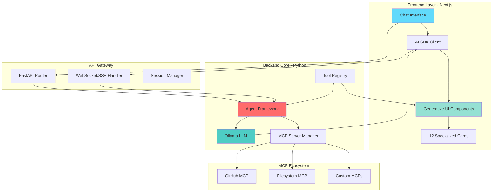
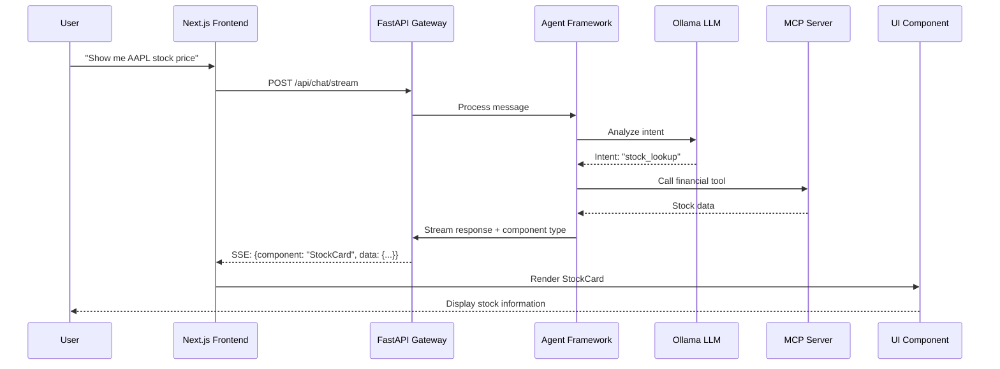
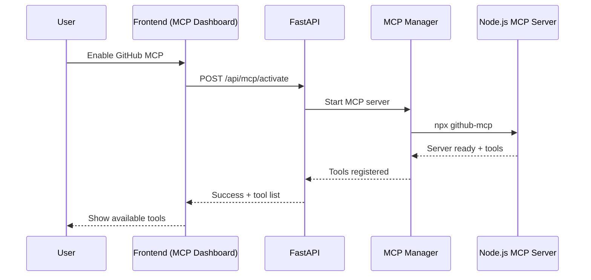

# Agent Framework & Generative UI 통합 계획서

## 📋 프로젝트 개요

본 문서는 두 개의 독립적인 프로젝트를 하나의 통합 시스템으로 결합하는 계획을 제시합니다:

1. **Agent Framework**: Python/FastAPI 기반 로컬 LLM + MCP + Microsoft Agent Framework
2. **Generative UI**: Next.js/TypeScript 기반 동적 UI 컴포넌트 생성 시스템

### 통합 목표

- 로컬 실행 가능한 AI 에이전트 시스템과 동적 UI 생성 기능의 결합
- 완전한 프라이버시 보장 (로컬 LLM 활용)
- 확장 가능한 MCP 도구 시스템
- 실시간 스트리밍 기반 대화형 UI

---

## 🎯 통합 전략

### 아키텍처 패턴: **Unified Full-Stack Application**

**Backend (Python/FastAPI)**: 핵심 AI 엔진 역할
- Ollama 로컬 LLM
- Microsoft Agent Framework
- MCP 서버 관리
- 비즈니스 로직 처리

**Frontend (Next.js/TypeScript)**: 동적 UI 레이어
- Generative UI 컴포넌트 라이브러리
- 실시간 스트리밍 UI
- 사용자 인터페이스

**통합 레이어**: REST API + WebSocket/SSE
- FastAPI ↔ Next.js 통신
- 스트리밍 응답 처리
- 세션 관리

---

## 📐 시스템 아키텍처



---

## 🏗️ 프로젝트 구조

```
agentframework-generativeui/
├── backend/                          # Python/FastAPI 백엔드
│   ├── agents/                       # Agent Framework 로직
│   │   ├── __init__.py
│   │   ├── base_agent.py
│   │   └── chat_agent.py
│   ├── mcp/                          # MCP 서버 관리
│   │   ├── __init__.py
│   │   ├── server_manager.py
│   │   └── tool_registry.py
│   ├── routers/                      # API 엔드포인트
│   │   ├── __init__.py
│   │   ├── chat.py
│   │   ├── mcp.py
│   │   └── ui_tools.py              # [NEW] Generative UI 도구 엔드포인트
│   ├── services/                     # 비즈니스 로직
│   │   ├── __init__.py
│   │   ├── ollama_service.py
│   │   └── streaming_service.py
│   ├── models/                       # 데이터 모델
│   │   ├── __init__.py
│   │   └── schemas.py
│   ├── config/                       # 설정 파일
│   │   ├── settings.py
│   │   └── mcp_servers.yaml
│   ├── main.py                       # FastAPI 앱 진입점
│   └── requirements.txt
│
├── frontend/                         # Next.js 프론트엔드
│   ├── app/                          # Next.js App Router
│   │   ├── layout.tsx
│   │   ├── page.tsx                  # 메인 채팅 인터페이스
│   │   ├── globals.css
│   │   └── api/                      # [OPTIONAL] Next.js API routes
│   │       └── proxy/                # FastAPI 프록시 (개발 환경)
│   ├── components/                   # Generative UI 컴포넌트
│   │   ├── ui/                       # 12개 전문 카드 컴포넌트
│   │   │   ├── stock-card.tsx
│   │   │   ├── weather-card.tsx
│   │   │   ├── flight-card.tsx
│   │   │   ├── recipe-card.tsx
│   │   │   ├── movie-card.tsx
│   │   │   └── [7 more cards]
│   │   ├── chat/                     # 채팅 UI 컴포넌트
│   │   │   ├── message-list.tsx
│   │   │   ├── message-input.tsx
│   │   │   └── streaming-message.tsx
│   │   └── mcp/                      # [NEW] MCP 관리 UI
│   │       ├── mcp-dashboard.tsx
│   │       └── tool-selector.tsx
│   ├── lib/                          # 유틸리티 및 클라이언트
│   │   ├── api-client.ts             # FastAPI 클라이언트
│   │   ├── streaming.ts              # SSE/WebSocket 핸들러
│   │   └── types.ts                  # TypeScript 타입 정의
│   ├── public/                       # 정적 파일
│   ├── package.json
│   ├── tsconfig.json
│   ├── tailwind.config.js
│   └── next.config.js
│
├── shared/                           # [NEW] 공유 리소스
│   ├── schemas/                      # API 스키마 (OpenAPI)
│   │   └── api.yaml
│   └── types/                        # 공유 타입 정의
│       └── common.ts
│
├── config/                           # 전역 설정
│   ├── .env.example
│   ├── .env.development
│   └── .env.production
│
├── docs/                             # 문서
│   ├── INTEGRATION_PLAN.md           # 본 문서
│   ├── ARCHITECTURE.md
│   ├── API_REFERENCE.md
│   └── diagrams/
│       └── *.mmd                     # Mermaid 다이어그램
│
├── scripts/                          # 자동화 스크립트
│   ├── setup.sh                      # 초기 설정
│   ├── dev.sh                        # 개발 서버 실행
│   └── build.sh                      # 프로덕션 빌드
│
├── docker/                           # Docker 설정
│   ├── Dockerfile.backend
│   ├── Dockerfile.frontend
│   └── docker-compose.yml
│
├── .gitignore
├── README.md
└── CHANGELOG.md
```

---

## 🔗 핵심 통합 포인트

### 1. API 통신 레이어

**FastAPI 엔드포인트 설계**:

```python
# backend/routers/ui_tools.py
@router.post("/api/chat/stream")
async def stream_chat_with_ui(request: ChatRequest):
    """
    채팅 메시지 처리 + Generative UI 컴포넌트 선택
    - Agent Framework로 의도 분석
    - MCP 도구 호출
    - 적절한 UI 컴포넌트 타입 반환
    """

@router.get("/api/tools/available")
async def get_available_tools():
    """
    사용 가능한 MCP 도구 + UI 컴포넌트 매핑 정보 반환
    """
```

**Next.js 클라이언트**:

```typescript
// frontend/lib/api-client.ts
export class AgentAPIClient {
  async streamChat(message: string): AsyncGenerator<UIComponent> {
    // SSE로 FastAPI와 통신
    // 스트리밍 응답을 UI 컴포넌트로 변환
  }

  async getAvailableTools(): Promise<Tool[]> {
    // MCP 도구 목록 조회
  }
}
```

### 2. 스트리밍 프로토콜

**SSE (Server-Sent Events) 포맷**:

```json
{
  "type": "component",
  "component": "StockCard",
  "props": {
    "symbol": "AAPL",
    "price": 150.25,
    "change": 2.5
  }
}

{
  "type": "text",
  "content": "Here's the stock information you requested."
}

{
  "type": "tool_call",
  "tool": "github_search",
  "status": "running"
}
```

### 3. 도구 통합 전략

**MCP 도구 → UI 컴포넌트 매핑**:

| MCP 도구 카테고리 | UI 컴포넌트 | 용도 |
|------------------|-------------|------|
| 금융 데이터 API | StockCard, FlightCard | 실시간 가격, 항공편 정보 |
| 날씨 API | WeatherCard | 날씨 예보 시각화 |
| 검색 API | ProductCard, MovieCard | 상품, 영화 검색 결과 |
| 파일 시스템 | RecipeCard, BookCard | 로컬 데이터 표시 |
| GitHub API | NewsCard, EventCard | 저장소, 이슈 정보 |

**도구 등록 시스템**:

```python
# backend/mcp/tool_registry.py
class ToolRegistry:
    def register_ui_mapping(self, tool_name: str, ui_component: str):
        """MCP 도구와 UI 컴포넌트 연결"""

    def get_component_for_tool(self, tool_name: str) -> str:
        """도구 이름으로 UI 컴포넌트 조회"""
```

---

## 🔄 데이터 흐름

### 사용자 쿼리 처리 플로우



### MCP 도구 활성화 플로우



---

## 🛠️ 기술 스택 통합

### Backend Dependencies (Python)

```txt
# requirements.txt
fastapi>=0.104.0
uvicorn[standard]>=0.24.0
pydantic>=2.5.0
httpx>=0.25.0
python-dotenv>=1.0.0
ollama>=0.1.0
pyyaml>=6.0.1

# Microsoft Agent Framework (가상)
microsoft-agent-framework>=0.1.0

# 추가 통합 라이브러리
websockets>=12.0
python-multipart>=0.0.6
aiofiles>=23.2.1
```

### Frontend Dependencies (Node.js)

```json
{
  "dependencies": {
    "next": "15.0.0",
    "react": "^18.3.0",
    "react-dom": "^18.3.0",
    "typescript": "^5.3.0",
    "tailwindcss": "^3.4.0",
    "zod": "^3.22.0",
    "eventsource": "^2.0.2",
    "axios": "^1.6.0",
    "@tanstack/react-query": "^5.0.0"
  }
}
```

---

## 🔐 환경 설정

### Backend (.env)

```bash
# Ollama 설정
OLLAMA_BASE_URL=http://localhost:11434
OLLAMA_MODEL=qwen2.5:latest

# FastAPI 설정
API_HOST=0.0.0.0
API_PORT=8000
LOG_LEVEL=info

# MCP 설정
MCP_CONFIG_PATH=./config/mcp_servers.yaml
NODE_PATH=/usr/bin/node

# 보안
API_SECRET_KEY=your-secret-key-here
CORS_ORIGINS=http://localhost:3000,http://localhost:3001
```

### Frontend (.env.local)

```bash
# API 엔드포인트
NEXT_PUBLIC_API_URL=http://localhost:8000
NEXT_PUBLIC_WS_URL=ws://localhost:8000

# 기능 플래그
NEXT_PUBLIC_ENABLE_MCP_UI=true
NEXT_PUBLIC_ENABLE_ONBOARDING=true
```

---

## 🚀 실행 방법

### 개발 환경

```bash
# 1. Backend 실행
cd backend
python -m venv venv
source venv/bin/activate  # Windows: venv\Scripts\activate
pip install -r requirements.txt
python main.py

# 2. Frontend 실행 (새 터미널)
cd frontend
npm install
npm run dev

# 3. Ollama 실행 (새 터미널)
ollama pull qwen2.5:latest
ollama serve
```

### Docker Compose (권장)

```bash
docker-compose up -d
```

```yaml
# docker-compose.yml
version: '3.8'
services:
  backend:
    build: ./docker/Dockerfile.backend
    ports:
      - "8000:8000"
    environment:
      - OLLAMA_BASE_URL=http://ollama:11434
    depends_on:
      - ollama

  frontend:
    build: ./docker/Dockerfile.frontend
    ports:
      - "3000:3000"
    environment:
      - NEXT_PUBLIC_API_URL=http://backend:8000
    depends_on:
      - backend

  ollama:
    image: ollama/ollama:latest
    ports:
      - "11434:11434"
    volumes:
      - ollama_data:/root/.ollama

volumes:
  ollama_data:
```

---

## 📊 성능 최적화 전략

### 1. TTFT (Time to First Token) 최적화

- **목표**: < 500ms
- **방법**:
  - Ollama 모델 사전 로딩 (warmup)
  - HTTP 연결 풀링
  - 프롬프트 최적화 (간결한 시스템 프롬프트)
  - 캐싱 레이어 (Redis/메모리)

### 2. UI 렌더링 최적화

- **React Server Components**: 서버 사이드 렌더링
- **Streaming SSR**: 점진적 UI 업데이트
- **코드 분할**: 동적 import로 번들 크기 최소화
- **컴포넌트 메모이제이션**: React.memo() 활용

### 3. MCP 도구 성능

- **병렬 도구 호출**: 독립적인 도구는 동시 실행
- **타임아웃 설정**: 느린 도구 차단 방지
- **결과 캐싱**: 반복 쿼리 최적화

---

## 🧪 테스트 전략

### Backend 테스트

```python
# tests/test_integration.py
def test_chat_with_ui_component():
    """채팅 메시지가 올바른 UI 컴포넌트를 반환하는지 테스트"""

def test_mcp_tool_registration():
    """MCP 도구가 올바르게 등록되는지 테스트"""

def test_streaming_response():
    """스트리밍 응답이 올바른 포맷인지 테스트"""
```

### Frontend 테스트

```typescript
// __tests__/components/ui/stock-card.test.tsx
describe('StockCard', () => {
  it('renders stock data correctly', () => {
    // 컴포넌트 렌더링 테스트
  });
});

// __tests__/lib/api-client.test.ts
describe('AgentAPIClient', () => {
  it('handles streaming responses', async () => {
    // SSE 스트리밍 테스트
  });
});
```

### E2E 테스트

```typescript
// e2e/chat-flow.spec.ts
test('complete chat flow with UI generation', async ({ page }) => {
  await page.goto('http://localhost:3000');
  await page.fill('[data-testid="chat-input"]', 'Show me weather');
  await page.click('[data-testid="send-button"]');
  await expect(page.locator('[data-testid="weather-card"]')).toBeVisible();
});
```

---

## 🔒 보안 고려사항

### 1. API 보안

- **CORS 설정**: 허용된 origin만 접근
- **Rate Limiting**: DDoS 방지
- **입력 검증**: Pydantic 모델 활용
- **인증/인가**: JWT 토큰 (선택사항)

### 2. MCP 보안

- **도구 권한 관리**: 민감한 도구는 명시적 승인 필요
- **샌드박싱**: MCP 서버 격리 실행
- **로깅**: 모든 도구 호출 감사 로그

### 3. 프론트엔드 보안

- **XSS 방지**: React의 기본 이스케이핑 활용
- **CSP 헤더**: Content Security Policy 설정
- **환경 변수**: 민감 정보 노출 방지

---

## 📈 모니터링 및 로깅

### 로깅 구조

```python
# backend/main.py
import logging

logging.basicConfig(
    level=logging.INFO,
    format='%(asctime)s - %(name)s - %(levelname)s - %(message)s',
    handlers=[
        logging.FileHandler('logs/app.log'),
        logging.StreamHandler()
    ]
)

# 주요 로깅 포인트
- API 요청/응답
- Agent 의사결정 과정
- MCP 도구 호출
- 오류 및 예외
- 성능 메트릭 (TTFT, 응답 시간)
```

### 메트릭 수집

- **Prometheus**: 메트릭 수집
- **Grafana**: 시각화 대시보드
- **주요 메트릭**:
  - 요청 처리 시간
  - TTFT (Time to First Token)
  - MCP 도구 호출 횟수
  - 오류율

---

## 🗺️ 마이그레이션 로드맵

### Phase 1: 기반 구축 (Week 1-2)

- [ ] 프로젝트 구조 생성
- [ ] Backend: FastAPI 기본 설정
- [ ] Frontend: Next.js 기본 설정
- [ ] Docker 환경 구성
- [ ] 기본 API 통신 레이어 구현

### Phase 2: 핵심 통합 (Week 3-4)

- [ ] Agent Framework 통합
- [ ] Ollama LLM 연결
- [ ] MCP 서버 관리 시스템 이식
- [ ] Generative UI 컴포넌트 이식
- [ ] SSE 스트리밍 구현

### Phase 3: 기능 확장 (Week 5-6)

- [ ] 12개 UI 컴포넌트 완전 통합
- [ ] MCP 도구 ↔ UI 매핑 시스템
- [ ] MCP 관리 UI 구현
- [ ] 온보딩 플로우 구현
- [ ] 성능 최적화 (TTFT)

### Phase 4: 안정화 (Week 7-8)

- [ ] 단위 테스트 작성
- [ ] E2E 테스트 작성
- [ ] 보안 강화
- [ ] 문서화 완료
- [ ] 프로덕션 배포 준비

---

## 🎓 학습 리소스

### 필수 문서

- [FastAPI 공식 문서](https://fastapi.tiangolo.com/)
- [Next.js 공식 문서](https://nextjs.org/docs)
- [Ollama 문서](https://ollama.ai/docs)
- [Model Context Protocol 사양](https://modelcontextprotocol.io/)

### 참고 레포지토리

- [Vercel AI SDK Examples](https://github.com/vercel/ai)
- [FastAPI Best Practices](https://github.com/zhanymkanov/fastapi-best-practices)

---

## 📝 기여 가이드

### 개발 워크플로우

1. Feature branch 생성: `git checkout -b feature/your-feature`
2. 변경사항 커밋: `git commit -m "feat: add feature"`
3. Push: `git push origin feature/your-feature`
4. Pull Request 생성

### 코딩 컨벤션

**Python**:
- PEP 8 준수
- Type hints 사용
- Docstring (Google 스타일)

**TypeScript**:
- ESLint + Prettier
- Strict mode 활성화
- 명시적 타입 정의

---

## 🆘 트러블슈팅

### 일반적인 문제

**1. Ollama 연결 실패**
```bash
# 해결: Ollama 서버 확인
ollama list
curl http://localhost:11434/api/tags
```

**2. CORS 오류**
```python
# backend/main.py에서 CORS 설정 확인
app.add_middleware(
    CORSMiddleware,
    allow_origins=["http://localhost:3000"],
    allow_credentials=True,
    allow_methods=["*"],
    allow_headers=["*"],
)
```

**3. MCP 서버 시작 실패**
```bash
# Node.js 경로 확인
which node
# MCP 설정 파일 검증
cat config/mcp_servers.yaml
```

---

## 📞 지원 및 연락처

- **이슈 보고**: GitHub Issues
- **토론**: GitHub Discussions
- **이메일**: [담당자 이메일]

---

## 📜 라이선스

본 통합 프로젝트는 원본 프로젝트의 라이선스를 따릅니다:
- Agent Framework: [라이선스]
- Generative UI: [라이선스]

---

**문서 버전**: 1.0.0
**최종 업데이트**: 2025-11-21
**작성자**: Claude Code Integration Team
